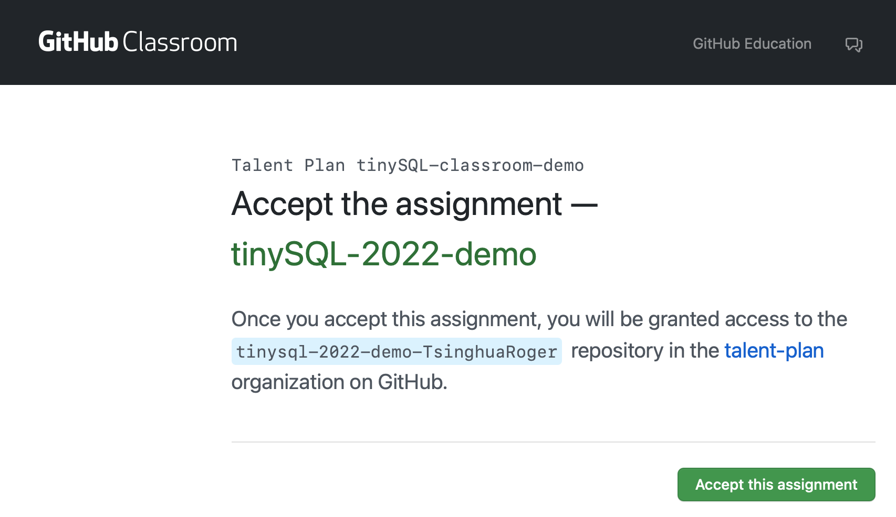
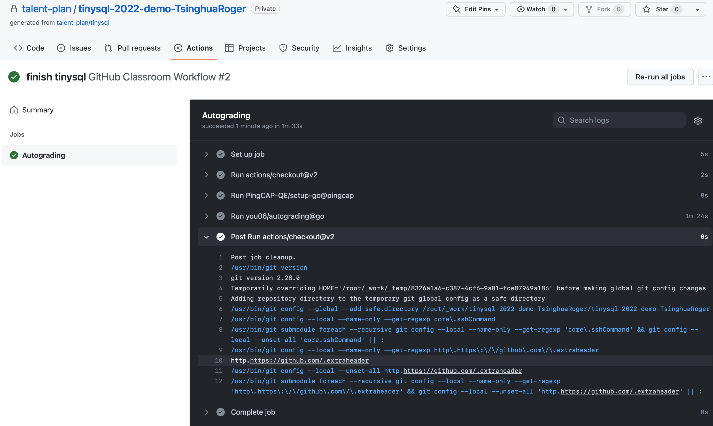

# GitHub Classroom

We mainly use [GitHub classroom](https://classroom.github.com/) to manage the working progress. After joining a tinySQL classroom, you're able to have your own private working repository and the CI will run the test scripts on your commits.

This document talks about the classroom usage.

## Join the Classroom

There is an invitation link for a tinySQL classroom, they look like `https://classroom.github.com/a/hashStr`, the *hashStr* will be replaced with a real value. Visit the invitation link and accept this assignment.



After that, we will create a private tinySQL repo under the orgnization talent-plan for you. You always can find the repo entry through the invitation link.

## Get a Classroom Invitation

The classroom invitation can be found in the [tinySQL learning class](https://talentplan.edu.pingcap.com/catalog/info/id:234)

## Autograding

Autograding is a workflow which can automatically run test cases and give feedback timely. However there are some limitations in Github classroom, in order to make golang work and run it in our self-hosted machines, **you need to overwrite the workflow generated by Github classroom and commit it**.

```sh
cp scripts/classroom.yml .github/workflows/classroom.yml
git add .github
git commit -m"update github classroom workflow"
```

## Commit Your Work

Now you're able to work on your local copy. Once you are ready to try with CI(feel free to use CI), commit your changes and push them to your `course` branch.

On your push, the CI script will start to run and you can check the progress by click the 'Actions' of your private repo.





After implementing all labs, the CI passed 🚀.

