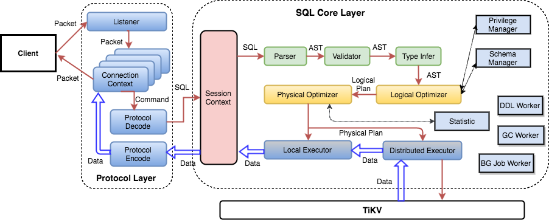
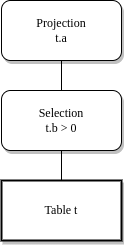
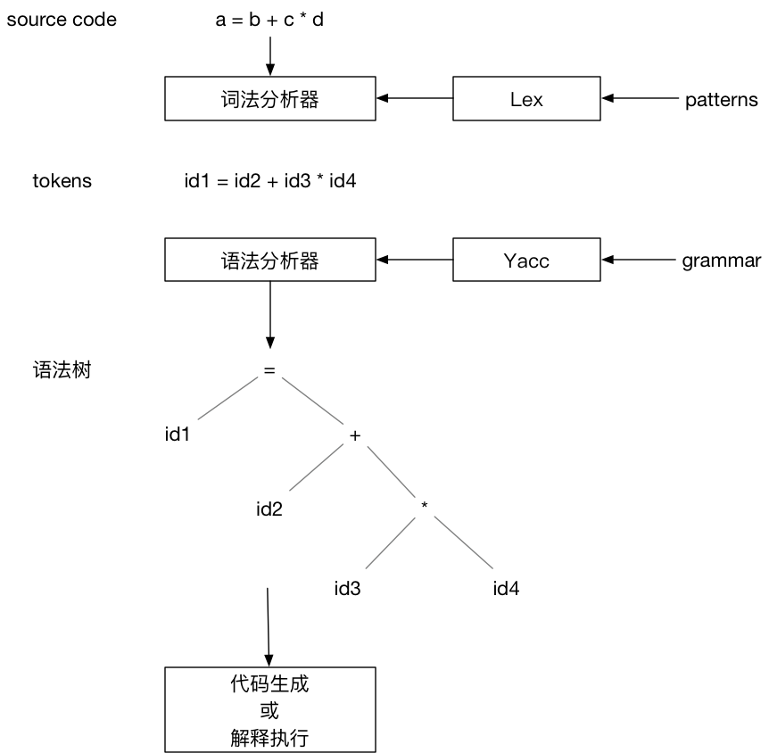

# Parser

## 简介

在 Parser 部分，我们将介绍 TinySQL 是如何将文本转化为 AST 的。

## SQL 处理流程

从前面的学习我们知道，在数据库中我们通过 SQL 语句来操作数据的。但是 SQL 本身只是文本数据，数据库需要在接收 SQL 文本、验证合法性等步骤之后才能对 SQL 语句进行处理。这其实是在计算机科学非常经典的编译问题，与程序语言的编译器十分相似。

在介绍 Parser 之前，我们将会介绍 SQL 语句在 TinySQL 中是如何进行处理的。



上图展示了 SQL 语句在 TinySQL 中的处理流程，从左往右看，当用户使用 MySQL Client 与 TinySQL 建立连接时，会通过图中的 Protocol Layer 部分的逻辑。紧接着，用户可能会通过 MySQL Client 发送 SQL 语句，此时通过 Protocol Layer 的逻辑，TinySQL 成功接收到了 SQL 语句，并尝试处理。这部分逻辑便是图中的 SQL Core Layer 部分。这部分要讲的内容便是位于最前面的 Parser。

## Parser 简介

Parser 主要的功能是将 SQL 语句文本按照预先定义的 SQL 语法规则进行解析，并将其转换为抽象语法树(Abstract Syntax Tree, AST)。抽象语法树是计算机科学中编译原理的一个术语。它以树形表现编程语言的语法结构。举个简单的例子，对于 SQL: Select a from t where b > 0; 将会被转换为：



其中，Projection 和 Selection 是关系代数中的投影和选择。简单来讲，这个抽象语法树从下至上的含义是：从表 t 中读取数据，只选择满足条件 t.b > 0 的数据，最后只需要列 t.a，与原 SQL 语句的含义一致。

### Lex & Yacc 介绍
在编译原理中，词法分析和语法分析是用来从语言文本生成抽象语法树的工具，其中[Lex & Yacc](http://dinosaur.compilertools.net/) 是一个知名但古老的用来生成词法分析器和语法分析器的工具。

在这个项目中，我们不需要深入了解词法分析器和语法分析器，我们只需要能够看懂语法定义文件、了解生成的解析器如何工作即可。下面有个简单的例子：



上图使用了 Lex & Yacc 构建编译器的流程。其中，Lex 根据用户定义的 patterns 生成词法分析器。词法分析器读取源代码，根据 patterns 将源代码转换成 tokens 输出。Yacc 根据用户定义的语法规则生成语法分析器。语法分析器以词法分析器输出的 tokens 作为输入，根据语法规则创建出语法树。最后对语法树遍历生成输出结果，结果可以是产生机器代码，或者是边遍历 AST 边解释执行。

从上面的流程可以看出，用户需要分别为 Lex 提供 patterns 的定义，为 Yacc 提供语法规则文件，Lex & Yacc 根据用户提供的输入文件，生成符合他们需求的词法分析器和语法分析器。这两种配置都是文本文件，并且结构相同：

```goyacc
... definitions ...
%%
... rules ...
%%
... subroutines ...
```

文件内容由 %% 分割成三部分，我们重点关注中间规则定义部分。对于上面的例子，Lex 的输入文件如下：

```goyacc
...
%%
/* 变量 */
[a-z]    {
            yylval = *yytext - 'a';
            return VARIABLE;
         }   
/* 整数 */
[0-9]+   {
            yylval = atoi(yytext);
            return INTEGER;
         }
/* 操作符 */
[-+()=/*\n] { return *yytext; }
/* 跳过空格 */
[ \t]    ;
/* 其他格式报错 */
.        yyerror("invalid character");
%%
...
```

上面只列出了规则定义部分，可以看出该规则使用正则表达式定义了变量、整数和操作符等几种 token。例如整数 token 的定义如下：

```goyacc
[0-9]+  {
            yylval = atoi(yytext);
            return INTEGER; 
        }
```

当输入字符串匹配这个正则表达式，大括号内的动作会被执行：将整数值存储在变量 yylval 中，并返回 token 类型 INTEGER 给 Yacc。

再来看看 Yacc 语法规则定义文件：

```goyacc
%token INTEGER VARIABLE
%left '+' '-'
%left '*' '/'
...
%%

program:
        program statement '\n' 
        |
        ;

statement:
        expr                    { printf("%d\n", $1); }
        | VARIABLE '=' expr     { sym[$1] = $3; }
        ;
        
expr:
        INTEGER
        | VARIABLE              { $$ = sym[$1]; }
        | expr '+' expr         { $$ = $1 + $3; }
        | expr '-' expr         { $$ = $1 - $3; }
        | expr '*' expr         { $$ = $1 * $3; }
        | expr '/' expr         { $$ = $1 / $3; }
        | '(' expr ')'          { $$ = $2; }
        ;

%%
...
```

第一部分定义了 token 类型和运算符的结合性。四种运算符都是左结合，同一行的运算符优先级相同，不同行的运算符，后定义的行具有更高的优先级。

语法规则使用了 BNF 定义。BNF 可以用来表达上下文无关（context-free）语言，大部分的现代编程语言都可以使用 BNF 表示。上面的规则定义了三个产生式。产生式冒号左边的项（例如 statement）被称为非终结符， INTEGER 和 VARIABLE 被称为终结符,它们是由 Lex 返回的 token。终结符只能出现在产生式的右侧。可以使用产生式定义的语法生成表达式：

```goyacc
expr -> expr * expr
     -> expr * INTEGER
     -> expr + expr * INTEGER
     -> expr + INTEGER * INTEGER
     -> INTEGER + INTEGER * INTEGER
```

解析表达式是生成表达式的逆向操作，我们需要归约表达式到一个非终结符。Yacc 生成的语法分析器使用自底向上的归约（shift-reduce）方式进行语法解析，同时使用堆栈保存中间状态。还是看例子，表达式 x + y * z的解析过程：

```goyacc
1    . x + y * z
2    x . + y * z
3    expr . + y * z
4    expr + . y * z
5    expr + y . * z
6    expr + expr . * z
7    expr + expr * . z
8    expr + expr * z .
9    expr + expr * expr .
10   expr + expr .
11   expr .
12   statement .
13   program  .
```

点（.）表示当前的读取位置，随着 . 从左向右移动，我们将读取的 token 压入堆栈，当发现堆栈中的内容匹配了某个产生式的右侧，则将匹配的项从堆栈中弹出，将该产生式左侧的非终结符压入堆栈。这个过程持续进行，直到读取完所有的 tokens，并且只有启始非终结符（本例为 program）保留在堆栈中。

产生式右侧的大括号中定义了该规则关联的动作，例如：

```goyacc
expr:  expr '*' expr         { $$ = $1 * $3; }
```

我们将堆栈中匹配该产生式右侧的项替换为产生式左侧的非终结符，本例中我们弹出 expr '*' expr，然后把 expr 压回堆栈。 我们可以使用 $position 的形式访问堆栈中的项，$1 引用的是第一项，$2 引用的是第二项，以此类推。$$ 代表的是归约操作执行后的堆栈顶。本例的动作是将三项从堆栈中弹出，两个表达式相加，结果再压回堆栈顶。

上面例子中语法规则关联的动作，在完成语法解析的同时，也完成了表达式求值。一般我们希望语法解析的结果是一棵抽象语法树（AST），可以这么定义语法规则关联的动作：

```goyacc
...
%%
...
expr:
    INTEGER             { $$ = con($1); }
    | VARIABLE          { $$ = id($1); }
    | expr '+' expr     { $$ = opr('+', 2, $1, $3); }
    | expr '-' expr     { $$ = opr('-', 2, $1, $3); }
    | expr '*' expr     { $$ = opr('*', 2, $1, $3); } 
    | expr '/' expr     { $$ = opr('/', 2, $1, $3); }
    | '(' expr ')'      { $$ = $2; }
    ; 
%%
nodeType *con(int value) {
    ...
}
nodeType *id(int i) {
    ...
}
nodeType *opr(int oper, int nops, ...) {
    ...
}    
```

上面是一个语法规则定义的片段，我们可以看到，每个规则关联的动作不再是求值，而是调用相应的函数，该函数会返回抽象语法树的节点类型 nodeType，然后将这个节点压回堆栈，解析完成时，我们就得到了一颗由 nodeType 构成的抽象语法树。对这个语法树进行遍历访问，可以生成机器代码，也可以解释执行。

至此，我们大致了解了 Lex & Yacc 的原理。其实还有非常多的细节，例如如何消除语法的歧义，但我们的目的是将其用于 TinySQL，掌握这些概念已经够用了。

### goyacc 简介

[goyacc](https://github.com/cznic/goyacc) 是 golang 版的 Yacc。和 Yacc 的功能一样，goyacc 根据输入的语法规则文件，生成该语法规则的 go 语言版解析器。goyacc 生成的解析器 yyParse 要求词法分析器符合下面的接口：

```go
type yyLexer interface {
    Lex(lval *yySymType) int
    Error(e string)
}
```

或者

```go
type yyLexerEx interface {
    yyLexer
    // Hook for recording a reduction.
    Reduced(rule, state int, lval *yySymType) (stop bool) // Client should copy *lval.
}
```

TinySQL 没有使用类似 Lex 的工具生成词法分析器，而是纯手工打造，词法分析器对应的代码是 parser/lexer.go ， 它实现了 goyacc 要求的接口：

```go
...
// Scanner implements the yyLexer interface.
type Scanner struct {
    r   reader
    buf bytes.Buffer

    errs         []error
    stmtStartPos int

    // For scanning such kind of comment: /*! MySQL-specific code */ or /*+ optimizer hint */
    specialComment specialCommentScanner

    sqlMode mysql.SQLMode
}
// Lex returns a token and store the token value in v.
// Scanner satisfies yyLexer interface.
// 0 and invalid are special token id this function would return:
// return 0 tells parser that scanner meets EOF,
// return invalid tells parser that scanner meets illegal character.
func (s *Scanner) Lex(v *yySymType) int {
    tok, pos, lit := s.scan()
    v.offset = pos.Offset
    v.ident = lit
    ...
}
// Errors returns the errors during a scan.
func (s *Scanner) Errors() []error {
    return s.errs
}
```

另外 lexer 使用了字典树技术进行 token 识别，具体的实现代码在 parser/misc.go, 感兴趣的同学可以自行学习，不作为本课程的要求。


### TinySQL Parser

到这里，我们已经掌握了所需要的前置知识，对于接下来的内容会更加容易理解。首先来看我们的 SQL 语法文件, parser/parser.y，goyacc 会根据这个文件生成对应的 SQL 语法解析器。

parser/parser.y 行数比较多，不过不要怕，该文件依然是上面介绍过的结构：
```goyacc
... definitions ...
%%
... rules ...
%%
... subroutines ...
```

parser.y 第三部分 subroutines 是空白没有内容的， 所以我们只需要关注第一部分 definitions 和第二部分 rules。

第一部分主要是定义 token 的类型、优先级、结合性等。注意 union 这个联合体结构体：

```goyacc
%union {
    offset int // offset
    item interface{}
    ident string
    expr ast.ExprNode
    statement ast.StmtNode
}
```

该联合体结构体定义了在语法解析过程中被压入堆栈的项的属性和类型。

压入堆栈的项可能是 终结符，也就是 token，它的类型可以是 item 或 ident；

这个项也可能是非终结符，即产生式的左侧，它的类型可以是 expr、 statement、 item 或 ident。

goyacc 根据这个 union 在解析器里生成对应的 struct 是：

```go
type yySymType struct {
    yys       int
    offset    int // offset
    item      interface{}
    ident     string
    expr      ast.ExprNode
    statement ast.StmtNode
}
```

在语法解析过程中，非终结符会被构造成抽象语法树（AST）的节点 ast.ExprNode 或 ast.StmtNode 。抽象语法树相关的数据结构都定义在 ast 包中，它们大都实现了 ast.Node 接口：

```go
// Node is the basic element of the AST.
// Interfaces embed Node should have 'Node' name suffix.
type Node interface {
    Accept(v Visitor) (node Node, ok bool)
    Text() string
    SetText(text string)
}
```

这个接口有一个 Accept 方法，接受 Visitor 参数，后续对 AST 的处理，主要依赖这个 Accept 方法，以 Visitor 模式遍历所有的节点以及对 AST 做结构转换。

```go
// Visitor visits a Node.
type Visitor interface {
    Enter(n Node) (node Node, skipChildren bool)
    Leave(n Node) (node Node, ok bool)
}
```

union 后面是对 token 和非终结符按照类型分别定义：

```goyacc
/* 这部分的 token 是 ident 类型 */
%token    <ident>
    ...
    add            "ADD"
    all             "ALL"
    alter            "ALTER"
    analyze            "ANALYZE"
    and            "AND"
    as            "AS"
    asc            "ASC"
    between            "BETWEEN"
    bigIntType        "BIGINT"
    ...

/* 这部分的 token 是 item 类型 */   
%token    <item>
    /*yy:token "1.%d"   */    floatLit        "floating-point literal"
    /*yy:token "1.%d"   */    decLit          "decimal literal"
    /*yy:token "%d"     */    intLit          "integer literal"
    /*yy:token "%x"     */    hexLit          "hexadecimal literal"
    /*yy:token "%b"     */    bitLit          "bit literal"

    andnot        "&^"
    assignmentEq    ":="
    eq        "="
    ge        ">="
    ...

/* 非终结符按照类型分别定义 */
%type    <expr>
    Expression            "expression"
    BoolPri                "boolean primary expression"
    ExprOrDefault            "expression or default"
    PredicateExpr            "Predicate expression factor"
    SetExpr                "Set variable statement value's expression"
    ...

%type    <statement>
    AdminStmt            "Check table statement or show ddl statement"
    AlterTableStmt            "Alter table statement"
    AlterUserStmt            "Alter user statement"
    AnalyzeTableStmt        "Analyze table statement"
    BeginTransactionStmt        "BEGIN TRANSACTION statement"
    BinlogStmt            "Binlog base64 statement"
    ...
    
%type   <item>
    AlterTableOptionListOpt        "alter table option list opt"
    AlterTableSpec            "Alter table specification"
    AlterTableSpecList        "Alter table specification list"
    AnyOrAll            "Any or All for subquery"
    Assignment            "assignment"
    ...

%type    <ident>
    KeyOrIndex        "{KEY|INDEX}"
    ColumnKeywordOpt    "Column keyword or empty"
    PrimaryOpt        "Optional primary keyword"
    NowSym            "CURRENT_TIMESTAMP/LOCALTIME/LOCALTIMESTAMP"
    NowSymFunc        "CURRENT_TIMESTAMP/LOCALTIME/LOCALTIMESTAMP/NOW"
    ...
```

第一部分的最后是对优先级和结合性的定义：

```goyacc
...
%precedence sqlCache sqlNoCache
%precedence lowerThanIntervalKeyword
%precedence interval
%precedence lowerThanStringLitToken
%precedence stringLit
...
%right   assignmentEq
%left     pipes or pipesAsOr
%left     xor
%left     andand and
%left     between
...
```

parser.y 文件的第二部分是 SQL 语法的产生式和每个规则对应的 aciton。SQL语法非常复杂，parser.y 的大部分内容都是产生式的定义。

SQL 语法可以参照 MySQL 参考手册的 SQL Statements 部分，例如 SELECT 语法的定义如下：

```sql
SELECT
    [ALL | DISTINCT | DISTINCTROW ]
      [HIGH_PRIORITY]
      [STRAIGHT_JOIN]
      [SQL_SMALL_RESULT] [SQL_BIG_RESULT] [SQL_BUFFER_RESULT]
      [SQL_CACHE | SQL_NO_CACHE] [SQL_CALC_FOUND_ROWS]
    select_expr [, select_expr ...]
    [FROM table_references
      [PARTITION partition_list]
    [WHERE where_condition]
    [GROUP BY {col_name | expr | position}
      [ASC | DESC], ... [WITH ROLLUP]]
    [HAVING where_condition]
    [ORDER BY {col_name | expr | position}
      [ASC | DESC], ...]
    [LIMIT {[offset,] row_count | row_count OFFSET offset}]
    [PROCEDURE procedure_name(argument_list)]
    [INTO OUTFILE 'file_name'
        [CHARACTER SET charset_name]
        export_options
      | INTO DUMPFILE 'file_name'
      | INTO var_name [, var_name]]
    [FOR UPDATE | LOCK IN SHARE MODE]]
```

我们可以在 parser.y 中找到 SELECT 语句的产生式：

```goyacc
SelectStmt:
    "SELECT" SelectStmtOpts SelectStmtFieldList OrderByOptional SelectStmtLimit SelectLockOpt
    { ... }
|   "SELECT" SelectStmtOpts SelectStmtFieldList FromDual WhereClauseOptional SelectStmtLimit SelectLockOpt
    { ... }  
|   "SELECT" SelectStmtOpts SelectStmtFieldList "FROM"
    TableRefsClause WhereClauseOptional SelectStmtGroup HavingClause OrderByOptional
    SelectStmtLimit SelectLockOpt
    { ... } 
```

产生式 SelectStmt 和 SELECT 语法是对应的。

省略了大括号中的 action，这部分代码会构建出 AST的 ast.SelectStmt(parser/ast/dml.go) 节点：

```go
type SelectStmt struct {
    dmlNode
    resultSetNode

    // SelectStmtOpts wraps around select hints and switches.
    *SelectStmtOpts
    // Distinct represents whether the select has distinct option.
    Distinct bool
    // From is the from clause of the query.
    From *TableRefsClause
    // Where is the where clause in select statement.
    Where ExprNode
    // Fields is the select expression list.
    Fields *FieldList
    // GroupBy is the group by expression list.
    GroupBy *GroupByClause
    // Having is the having condition.
    Having *HavingClause
    // OrderBy is the ordering expression list.
    OrderBy *OrderByClause
    // Limit is the limit clause.
    Limit *Limit
    // LockTp is the lock type
    LockTp SelectLockType
    // TableHints represents the level Optimizer Hint
    TableHints []*TableOptimizerHint
}
```

可以看出，ast.SelectStmt 结构体内包含的内容和 SELECT 语法也是一一对应的。

其他的产生式也都是根据对应的 SQL 语法来编写的。从 parser.y 的注释看到，这个文件最初是用工具从 BNF 转化生成的，从头手写这个规则文件，工作量会非常大。

完成了语法规则文件 parser.y 的定义，就可以使用 goyacc 生成语法解析器：

```bash
cd parser
make
```

注意：你可以查看 Makefile 了解具体命令。另外，该命令中包含对 parser.y 的格式检查和自动整理格式，如果出现格式相关错误，需要再执行一次 make。

## 作业描述

完成 `JoinTable` 的实现，你可以利用 parser test 里失败的测试确定需要补充哪些语法部分。

## 测试

通过测试 `TestDMLStmt`。
完成代码后，在根目录执行

```bash
cd parser
make
```

即可完成 tinysql parser 的生成，该命令中包含对 parser.y 的格式检查和自动整理格式，如果出现格式相关错误，需要再执行一次 make。
然后
```bash
cd .. #回到根目录
make test-proj2
```
执行测试

## 评分

通过 `TestDMLStmt` 即可满分。

## References

- https://pingcap.com/zh/blog/tidb-source-code-reading-5
- https://github.com/cznic/goyacc
- http://dinosaur.compilertools.net/
- https://dev.mysql.com/doc/refman/8.0/en/
