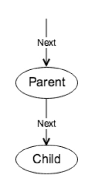

# 执行模型: 火山模型和向量化
-
## 概览

在这一章节我们将介绍执行层最核心的执行模型。

## 执行模型介绍

在介绍具体模型之前，我们先思考一下为什么需要模型。模型是对现实事物核心特质的简化，可以用来帮助人们理解问题。在前面的 SQL 部分中，可以看到 SQL 的可以表达语义复杂多变，但同时它也具有一定的特性：

- SQL 是由不同的部分组成的，每个部分有固定的语义
- 部分与部分之间是有一定关系的，每个部分都是对前一部分结果的进一步处理

### 火山模型
-
让我们先来看一看火山模型。在火山模型中，由不同的执行器组成，每个执行器对应的是 SQL 中的某个部分，例如过滤，聚合等；执行器与执行器之间组成了类似树状的关系，每个算子都实现了三个接口：

- Open，对当前执行器所需的资源进行初始化
- Next，从孩子节点（如果存在）取必需的数据，计算并返回一条结果
- Close，对执行器所需的资源进行释放

从这里也可以看到，火山模型是符合我们对模型的设想的，每个执行器负责特定的语义，并通过树型结构灵活地组合起来。那么它的缺点是什么呢？如果处理的数据量多，那么每个算子输出的每一行都对应一次 `Next` 调用，框架上的函数调用开销将会非常大。

### 向量化
-
减小函数调用的一个直观想法就是每次 `Next` 返回一批数据，而不是只返回一行。为了支持返回多行的操作，TinySQL 还使用了 `Chunk` 来表示这些行，用于减小内存分配开销、降低内存占用以及实现内存使用量统计/控制。

在结果按批返回后，也为计算的向量化带来了可能性，但首先，我们先来了解一下表达式及其计算。

## 理解代码

### 向量化表达式

在 [builtin\_string\_vec.go](https://github.com/pingcap-incubator/tinysql/blob/selection/expression/builtin_string_vec.go) 有三个较为简单的向量化的 string 类型函数，可以结合[向量化的进行计算](https://docs.google.com/document/d/1JKP9YS3wYsuXsYhDgVepJt5y72K6_WxhUVfOLyjpAjc/edit#heading=h.66r4twnr3b1c)阅读。

### 火山模型
-
我们以 Selection 为例来介绍代码。

在 [executor.go#L346](https://github.com/pingcap-incubator/tinysql/blob/selection/executor/executor.go#L346) 实现了一个较为简单的执行器 `Selection`，它的作用就是根据 `filters` 过滤掉不需要的行并返回给父亲，可以看到它也实现了常见的 `Open`, `Next` 和 `Close` 接口。可以通过阅读 unBatchedNext 理解一下它的功能。

## 作业描述

- 实现向量化表达式 [vecEvalInt](https://github.com/pingcap-incubator/tinysql/blob/selection/expression/builtin_string_vec.go#L89)，并将 [vectorized](https://github.com/pingcap-incubator/tinysql/blob/selection/expression/builtin_string_vec.go#L84) 的返回值改为 `true`
- 实现向量化 selection 的 [Next](https://github.com/pingcap-incubator/tinysql/blob/selection/executor/executor.go#L380) 函数。

## 测试

通过通过 `expression` 下所有测试和 `executor` 下面的 `TestJoin` 以及 `TestMergeJoin`。

你可以通过 `go test package_path -check.f func_name` 来跑一个具体的函数。以 `TestJoin` 为例，你可以使用 `go test github.com/pingcap/pingcap-incubator/tinysql/executor -check.f TestJoin` 来跑这个具体的函数。同时可以将输出文件重定向至文件中来后续 debug。

## 评分

`expression` 和 `executor` 各占 50%。
