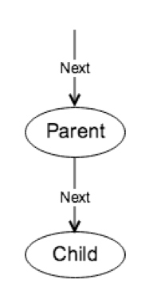

# Execution Models: Volcano Model and Vectorization

## Overview

In this section, we will introduce the core execution model in the execution layer.

## Introduction to Execution Models

A model is a simplification of the core characteristics of a real object and can help people understand the problem. In the previous SQL section, we can see that SQL can express complex and varied semantics, but at the same time it also has certain characteristics:

- SQL is made up of different parts, each with a fixed semantics
- There is a certain relationship between parts, and each section is a further processing of the results of the previous section

### Volcano model

In the volcano model, it consists of various executors. Each corresponds to a part of SQL, such as filtering and aggregation. It forms a tree structure between executors. Each executor implements three interfaces:

- 'Open', initialize the resources required by the current executor
- 'Next', takes the necessary data from the child node (if present), calculates and returns a result
- 'Close', releases the resources required by the executor

As can be seen from here, the volcano model is in line with our idea of the model. Each executor is responsible for specific semantics and can be flexibly combined through a tree structure. However, it also has some drawbacks. If a large amount of data is processed, then each line of the output of each operator corresponds to a `Next` call, and the overhead of calling function on the framework will be very large.

### Vectorization

One intuitive idea for reducing function calls is that the `Next` operator returns a batch of data each time, rather than just one row. To support operations that return multiple rows, TinySQL also uses `Chunk` to represent these rows, which is used to reduce memory allocation overhead, reduce memory usage, and implement memory usage statistics/control.

Since the results are returned in batches, it also opens the possibility of vectorizing the computation.

## Understanding the Code

### Volcano model

A relatively simple executor, `Selection`, is implemented in [Executor.go #L346](https://github.com/tidb-incubator/tinysql/blob/course/executor/executor.go#L346). Its function is to filter out unnecessary lines according to `filters` and return them to the parent. As you can see, it also implements common `Open`, `Next`, and `Close` interfaces. You may also refer to `UnbatchedNext`.

### Vectorized Expressions

There are three relatively simple vectorized string type function in [builtin_string_vec.go](https://github.com/tidb-incubator/tinysql/blob/course/expression/builtin_string_vec.go). 

## Tasks

- Implement the vectorized expression [veEvalint](https://github.com/tidb-incubator/tinysql/blob/course/expression/builtin_string_vec.go#L89) and change the return value of [vectorized](https://github.com/tidb-incubator/tinysql/blob/course/expression/builtin_string_vec.go#L84) to `true`
- Implement the [Next](https://github.com/tidb-incubator/tinysql/blob/course/executor/executor.go#L380) function in the vectorized selection.

## Tests

- Pass all tests under `expression`
- Pass `TestSelectExec` in `executor/executor_test.go`.

You can run tests directly through `make test-proj5-1`, or run a specific function through `go test package_path -check.f func_name`. Taking `TestSelectExec` as an example, you can use `go test ./executor -check.f "TestSelectExec"` to run this specific function.

## Grading
`expression` and `executor` each account for 50% of the total mark.
