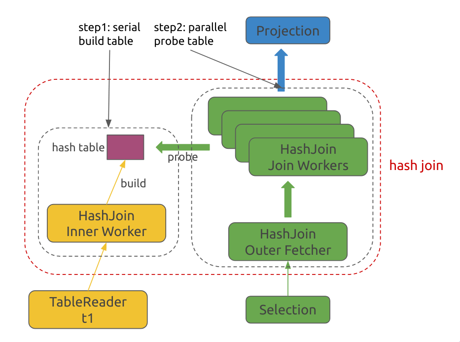
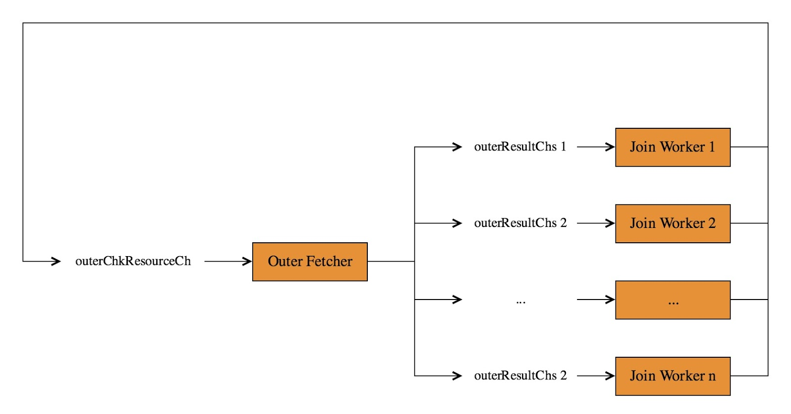
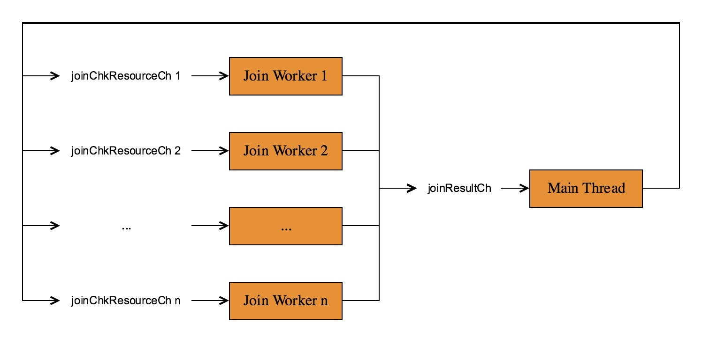

# Hash Join

## Overview

In this section we will learn about Hash Join and its implement. We will also talk about concurrent computation.

In addition, TinySQL also implements [Merge Join](https://github.com/pingcap-incubator/tinysql/blob/df75611ce926442bd6074b0f32b1351ca4aad925/executor/merge_join.go#L24), which is similar to Merge Sort.

## Introduction to Hash Join Algorithms

In Hash Join, we use the inner table to construct a hash table. Then, we match each row in the outer table using the hash table. After the hash table is built, the hash table is set to read-only, so the process of finding matches can actually be done in parallel, which means we can use multiple threads to check the hash table at the same time. Thus, the efficiency can be largely improved.

## Understanding the Code

As shown in the figure above, the main processes involved are as follows:

- Main Thread:
    1. Read all the data of the inner table and construct a hash table
    2. Start Outer Fetcher and Join Worker to generate join results in the background. The startup process for each `goroutine` is done by the `fetchAndProbeHashTable` function
    3. The Join result computed by the Join Worker is returned to the caller of the `NextChunk` interface.
- Outer Fetcher: 
    - There is one Outer Fetcher, which is responsible for reading data from the Outer table and distributing it to various Join Workers;
- Join Worker: 
    - There are multiple Join Workers, which are responsible for checking the data of the hash table, matching the records, and passing the results to the main thread.

Next, let's take a detailed look at each stage of Hash Join.

### Main Thread: reads the internal table data and constructs a hash table

The process of read the inner table data is done by the `fetchAndBuildHashTable` function. This process continuously calls child's `NextChunk` interface, and stores the chunk obtained from each function call into the `HashRowContainer` for use in the next computation.

The hash table we use here is essentially a linked list, the key which has the same hash value are connected together. When searching for the values, we can iterate through the linked list.

### Outer Fetcher

Outer Fetcher is a background `goroutine`. Its main computational logic is implemented in the function `fetchouterSideHunks`. It continuously read the data from the outer table and distributes the data to join workers. The resource interaction between multiple threads is shown in following figure:

There are two channels involved:

1. OuterResultCHs[i]: The Outer Fetcher writes the obtained Outer Chunk to this channel, so that the corresponding Join Worker can use it.
2. OuterChkResourceCH: When the Join Worker finishes the current Outer Chunk, it needs to write this Chunk along with its corresponding OuterResultChs[i] address to the `OuterChkResourceCH` channel, and tell Outer Fetcher two pieces of information:
    - Here is the `Chunk`. You can use this `Chunk` directly to pull the outer data. There no need to re-apply for memory.
    - I have finished processing the Outer Chunk. Please provide me Outer data.

So, the overall logic of Outer Fetcher is:

1. Get an `outerChkResource` from `outerChkResourceCh` and store it in the variable `outerResource`
2. Pull the data from child and write the data into the `chk` field of `OuterResource`
3. Send the `chk` to `OuterResultChs[i]` of the Join Worker that requires data from the Outer Table. This information is recorded in the dest field of `OuterResource`

### Join Worker

Each Join Worker is a backend `goroutine`, and the main logic is implemented in the `RunJoinWorker` function.

There are two channels involved:

1. `JoinchkResourceCH[i]`: one for each Join Worker to store the results of the Join
2. `JoinResultCH`: The Join Worker writes the result Chunk and its `JoinChkResourceCH` address to this channel, and tell the main thread that:
    - Here is the result of a Join in Chunk. You can directly return it to the caller of the `Next` function
    - Return this chunk to me after you finished

So, the overall calculation logic of Join Worker is:

1. Get a Join Chunk Resource
2. Get an Outer Chunk
3. Check the hash table and write matching Outer Rows and Inner Rows into Join Chunk
4. Send the full Join Chunk to the Main Thread

### Main thread

The computational logic for the main thread is implemented by the `nextChunk` function. The computational logic for the main thread is straightforward:

1. Get a Join Chunk from `JoinResultCH`
2. Exchange the data from `chk` and the `Join Chunk` sent by the function caller
3. Return the Join Chunk to the corresponding Join Worker

## Tasks

Implement [runJoinWorker](https://github.com/tidb-incubator/tinysql/blob/course/executor/join.go#L243) and [fetchAndBuildHashTable](https://github.com/tidb-incubator/tinysql/blob/course/executor/join.go#L148).

## Tests

- Pass all test cases in the `join_test.go` except the `TestJoin`. 
- The `TestJoin` test case involves the `aggregate` method in project5-3. You can test it after completing the entire project 5. This test will not count towards the final score.

You can run tests via `make test-proj5-2`.

## Grading
Pass all the tests to get 100 points. Points will be deducted proportionately if any tests fail.
