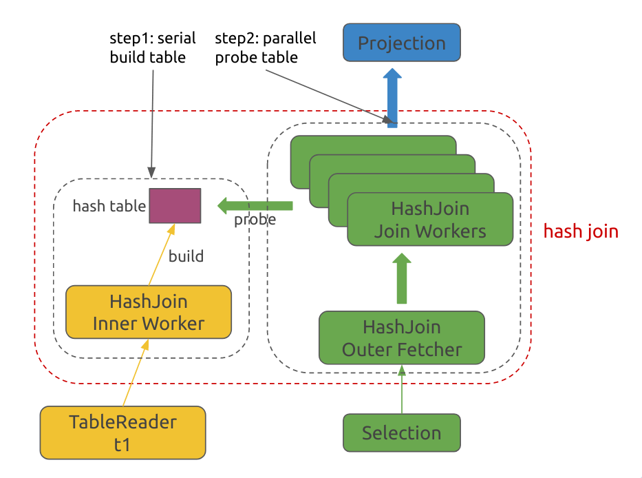

# Hash Join
-
## 概览

在这一小节我们将学习 Hash Join 及其实现，并且从这一小节开始我们将接触并发计算
。Hash Join 是实现 Join 的一种常见方式，除此之外 TinySQL 还实现了与 Merge Sort 思想较类似的 [Merge Join](https://github.com/pingcap-incubator/tinysql/blob/df75611ce926442bd6074b0f32b1351ca4aad925/executor/merge_join.go#L24)，感兴趣可以自行阅读。

## Hash Join 算法简介

简单来说，对于两张表的 Hash Join，我们会选择选择一个内表来构造哈希表，然后对外 表的每一行数据都去这个哈希表中查找是否有匹配的数据。那怎样提高 Hash Join 的效率呢？在建立好哈希表后，实际上哈希表就是只读的了，那么查找匹配的过程其实是可以并行起来的，也就是说我们可以用多个线程同时查哈希表：

这样可以大大提高 Hash Join 的效率。

## 理解代码

从上图也可以看到，其包含的主要过程如下：

- Main Thread：一个，执行下列任务：
	1. 读取所有的 Inner 表数据并构造哈希表
	2. 启动 Outer Fetcher 和 Join Worker 开始后台工作，生成 Join 结果。各个 goroutine 的启动过程由 fetchAndProbeHashTable 这个函数完成；
	3. 将 Join Worker 计算出的 Join 结果返回给 NextChunk 接口的调用方。
- Outer Fetcher：一个，负责读取 Outer 表的数据并分发给各个 Join Worker；
- Join Worker：多个，负责查哈希表、Join 匹配的 Inner 和 Outer 表的数据，并把结果传递给 Main Thread。

接下来我们细致的介绍 Hash Join 的各个阶段。

### Main Thread 读内表数据并构造哈希表

读 Inner 表数据的过程由 fetchAndBuildHashTable 这个函数完成。这个过程会不断调用 Child 的 NextChunk 接口，把每次函数调用所获取的 Chunk 存储到 hashRowContainer 中供接下来的计算使用。

我们这里使用的哈希表本质上是一个链表，将具有相同 Key 哈希值的类似链表的方式连在一起，这样后续查找具有相同 Key 的值时只需要遍历链表即可。

### Outer Fetcher

Outer Fetcher 是一个后台 goroutine，他的主要计算逻辑在 fetchOuterSideChunks 这个函数中。它会不断的读大表的数据，并将获得的 Outer 表的数据分发给各个 Join Worker。这里多线程之间的资源交互可以用下图表示：

上图中涉及到了两个 channel：

1. outerResultChs[i]：每个 Join Worker 一个，Outer Fetcher 将获取到的 Outer Chunk 写入到这个 channel 中供相应的 Join Worker 使用
2. outerChkResourceCh：当 Join Worker 用完了当前的 Outer Chunk 后，它需要把这个 Chunk 以及自己对应的 outerResultChs[i] 的地址一起写入到 outerChkResourceCh 这个 channel 中，告诉 Outer Fetcher 两个信息：
	1. 我提供了一个 Chunk 给你，你直接用这个 Chunk 去拉 Outer 数据吧，不用再重新申请内存了；
	2. 我的 Outer Chunk 已经用完了，你需要把拉取到的 Outer 数据直接传给我，不要给别人了；

所以，整体上 Outer Fetcher 的计算逻辑是：

1. 从 outerChkResourceCh 中获取一个 outerChkResource，存储在变量 outerResource 中
2. 从 Child 那拉取数据，将数据写入到 outerResource 的 chk 字段中
3. 将这个 chk 发给需要 Outer 表的数据的 Join Worker 的 outerResultChs[i] 中去，这个信息记录在了 outerResource 的 dest 字段中

### Join Worker

每个 Join Worker 都是一个后台 goroutine，主要计算逻辑在 runJoinWorker 这个函数中。

上图中涉及到两个 channel：

1. joinChkResourceCh[i]：每个 Join Worker 一个，用来存 Join 的结果
2. joinResultCh：Join Worker 将 Join 的结果 Chunk 以及它的 joinChkResourceCh 地址写入到这个 channel 中，告诉 Main Thread 两件事：
	1. 我计算出了一个 Join 的结果 Chunk 给你，你读到这个数据后可以直接返回给你 Next 函数的调用方
	2. 你用完这个 Chunk 后赶紧还给我，不要给别人，我好继续干活

所以，整体上 Join Worker 的计算逻辑是：

1. 获取一个 Join Chunk Resource
2. 获取一个 Outer Chunk
3. 查哈希表，将匹配的 Outer Row 和 Inner Rows 写到 Join Chunk 中
4. 将写满了的 Join Chunk 发送给 Main Thread

### Main Thread

主线程的计算逻辑由 NextChunk 这个函数完成。主线程的计算逻辑非常简单：

1. 从 joinResultCh 中获取一个 Join Chunk 
2. 将调用方传下来的 chk 和 Join Chunk 中的数据交换
3. 把 Join Chunk 还给对应的 Join Worker

## 作业

实现 [runJoinWorker](https://github.com/pingcap-incubator/tinysql/blob/hash-join/executor/join.go#L243) 以及 [fetchAndBuildHashTable](https://github.com/pingcap-incubator/tinysql/blob/hash-join/executor/join.go#L148)。

## 测试

通过 `join_test.go` 下的所有测试

## 评分

全部通过可得 100 分。若有测试未通过按比例扣分。

