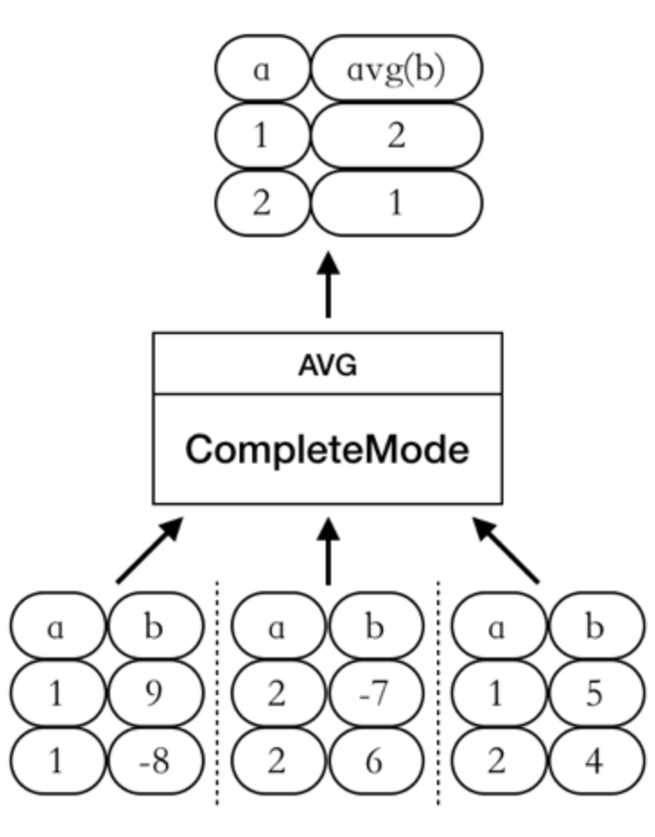
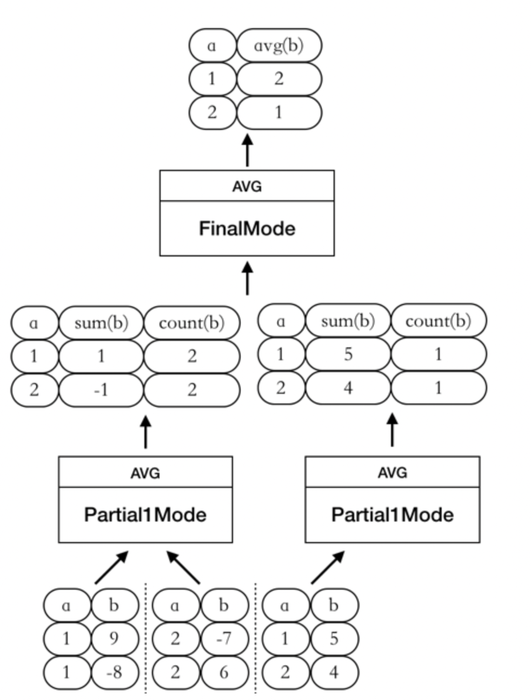

# Hash Aggregate

## Overview

In this section, we will explain the principles and implement of Hash Aggregate.

## An introduction to Hash Aggregate

Let's review aggregation via an example. Taking `select sum(b) from t group by a` as an example, it finds the sum of column `b` with the same value in column `a`. In the result, each different `a` will only output one row. The final result is in the format of a map (`m<a, sum (b)`).

It is possible to optimize the process. One observation is that a function like sum satisfies the commutative property and the associative property , which means that the order of addition is not important. For example, assuming that a specific value of `a` has 10 rows, we can first calculate the `sum(b)` value of 5 rows, and then calculate the `sum(b)` value of the other 5 rows, finally combine these results.

It is also possible to the `avg` function. We can split it into two aggregate function, namely `sum(b)` and `count(b)`. Both function satisfy the commutative property and the associative property, so we can also use the above method to optimize.

Thus, we introduce an intermediate state. In the intermediate state, each worker takes a portion of the data from the child node and pre-calculates it. Then, each worker hand over the results to a final worker that merges the partial worker results, so the overall execution efficiency can be improved.

However, one possible drawback is when `a` has a large number of different values, causing the final worker to become a bottleneck. To solve this problem, you may use multiple final workers, and using hash function to guarantee that the same value of `a` are sent to the same worker.

In order to adapt to the above parallel computation model, TinySQL define four calculation modes: `CompleteMode`, `FinalMode`, `Partial1Mode`, and `Partial2Mode`. In different calculation modes, the processed input values and output values vary, as shown in the following table:

| aggFunctionMode | input value | output value |
| :-------------- | ----: | ----: |
|CompleteMode | Raw Data | Final Results |
|finalMode| intermediate result | final result |
|Partial1Mode| Raw Data | Intermediate Results |
|Partial2Mode| Intermediate Results | Further Aggregated Intermediate Results |

Using `select avg(b) from t group by a` as an example, the job can be finished using various combination of `AggFunctionMode`.

- CompleteMode

  By using `CompleteMode`, the job can be finished within one stage:

  

- Partial1Mode --> FinalMode

  The job can also be finished using `Partial1Mode` plus `FinalMode`.

  

In addition to the two examples above, aggregation may also be pushed down to TinyKV for `computation` (`Partial1Mode`) and the intermediate results that have been pre-aggregated will be returned. In order to fully utilize the CPU and memory resources of the machine where `TinySQL` is located and accelerate the aggregation calculation at the TinySQL layer, the aggregation function calculation at the TinySQL layer can be performed as follows: `Partial2Mode` --> `FinalMode`.

## Understanding the Code

The threads involved in the execution of TiDB's parallel hash aggregation are: Main Thead, Data Fetcher, Partial Worker, and Final Worker:

- One main thread:
    - Start Input Reader, Partial Workers, and Final Workers
    - Wait for the execution results from the Final Worker and return the results
- One Data Fetcher:
    - Read child node data in batches and distribute it to partial workers
- Multiple Partial Workers:
    - Read the data sent by the Data Fetcher and pre-aggregate the data
    - Shuffle pre-aggregated results to the corresponding Final Worker based on Group values
- Multiple Final Workers:
    - Read the data sent by PartialWorker, calculate the final result, and send it to the Main Thread

The execution phase of hash aggregation can be divided into 5 steps as shown in the following figure:

1. Start `Data Fetcher`, `Partial Workers`, and `Final Workers`

   This part of the work is done by the `PrePARE4ParallelExec` function. This function starts a `Data Fetcher`, multiple `Partial Workers`, and multiple `Final Workers`.

2. `DataFetcher` reads child node data and distributes it to `Partial Workers`

   This part of the work is done by the `fetchChildData` function.

3. `Partial Workers` pre-aggregate the calculation results, and shuffle to the results to corresponding Final Workers based on Group Key Shuffle

   This part of the work is done by the `hashAggpartialWorker.run` function. This function calls the `UpdatePartialResult` function to perform pre-aggregation calculations on data sent from DataFetcher and stores the pre-aggregated results in PartialResultMap. The key of `PartialResultMap` is the result encoded according to the Group-By value, and the value is a `partialResult` type array. Each element in the array represents the pre-aggregated result of the aggregation function for a particular group at the corresponding subscript. The `shuffleIntermData` function performs shuffling of the intermediate data for the corresponding final worker based on the group value.

4. Final Worker calculates the final result and sends it to the Main Thread

   The `hashAggFinalWorker.run` function handles this task. It calls the `consumeIntermData` function to receive the intermediate results that have been pre-aggregated by the `PartialWorkers`, and then merges them into the final result. The `getFinalResult` function is used to send the final result backs to the main thread.

5. Main Thread receives the final results and returns the results

## Tasks

- Complete the TODO code in `aggregate.go`, including the two method `consumeIntermData` and `shuffleIntermData`.

## Tests

- Complete all tests in `aggregate_test.go`. You can run tests via `make test-proj5-3`

## Grading

Pass them all and get 100 points. Points will be deducted proportionately if any tests fail.
