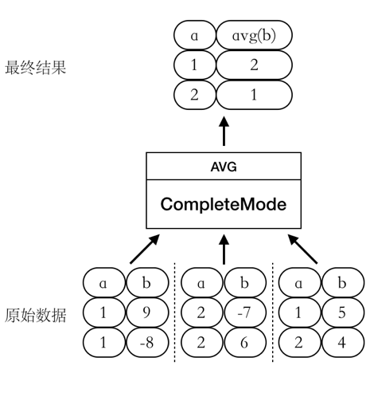
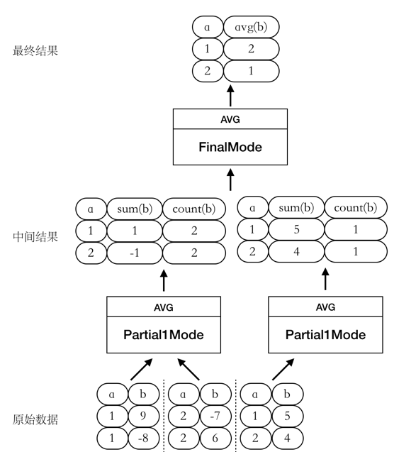
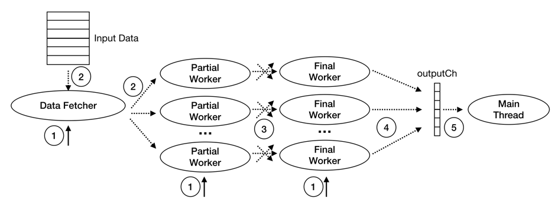

# Hash Aggregate

## Overview

In this section, we will explain the principles and implement of Hash Aggregate in depth.

## About Hash Aggregate

Before we understand Hash aggregation, let's review aggregation. Taking `select sum(b) from t group by a` as an example, its meaning is to find the sum of column b with the same value in column a, which means that in the end, each different ‘a’ will only output one row, so in fact, the final result can be thought of as a map<a, sum (b) > like a map, so updating the values of the map is also relatively simple.

How can I optimize it? One observation is that a function like sum satisfies the commutative law and the associative law , which means that the order of addition has nothing to do with it. For example, assuming that a specific value of ‘a’ has 10 rows, then we can first calculate the sum (b) values of 5 rows, then calculate the sum (b) values of the other 5 rows, and then combine these results.

How can I optimize a function like avg? We can split it into two aggregate function, namely sum (b) and count (b). Both function satisfy the commutative law and the associative law, so we can also use the above method to optimize.

Well, one possible optimization is that we introduce an intermediate state. At this time, each partial worker takes a portion of the data from the child node and pre-calculates it. Note that the results obtained at this time may be incorrect, and then hand over the results to a final worker that merges the partial worker results, so the overall execution efficiency can be improved.

However, one possible result of the model above is that column ‘a’ has a large number of different values, causing the final worker to become a bottleneck. How can we remove this bottleneck? One idea is to split final workers into multiple pieces, but how to ensure correctness at this time? That is, how can the intermediate results that are calculated by the partial worker and with the same ‘a' value be mapped to the same final worker? At this point, the hash function is a good solution. We can hash the value on ’a‘, and then hand over the intermediate result with the same hash value to the same final worker.

In this way, we have the execution model for Hash Agg in TinySQL.
In order to adapt to the above parallel computation, TiDB divides the calculation stages of the aggregate function and defines 4 calculation modes accordingly: CompleteMode, FinalMode, Partial1Mode, and Partial2Mode. In different calculation modes, the processed input values and output values will vary, as shown in the following table:

| aggFunctionMode | input value | output value |
| :-------------- | ----: | ----: |
|CompleteMode | Raw Data | Final Results |
|finalMode| intermediate result | final result |
|Partial1Mode| Raw Data | Intermediate Results |
|Partial2Mode| Intermediate Results | Further Aggregated Intermediate Results |

Taking the `select avg(b) from t group by a` mentioned above as an example, by dividing the calculation stages, there can be a combination of different calculation modes, such as:

- CompleteMode

At this point, the entire calculation of the AVG function has only one stage, as shown in the image:

- Partial1Mode --> FinalMode

At this point, we split the AVG function calculation process into two stages, as shown in the image:

In addition to the two examples above, it is also possible that the aggregation is pushed down to TinyKV for calculation (Partial1Mode) and an intermediate result that has been pre-aggregated is returned. In order to make full use of the CPU and memory resources of the machine where TinySQL is located and speed up the aggregation calculation of the TinySQL layer, the aggregation function calculation of the TinySQL layer can be performed like this: Partial2Mode --> FinalMode.

## Understanding the Code

The main threads in the execution of TiDB's parallel hash aggregation operator are: Main Thead, Data Fetcher, Partial Worker, and Final Worker:

- One main thread:
    - Start Input Reader, Partial Workers, and Final Workers
    - Wait for Final Worker execution results and return
- One Data Fetcher:
    - Read child node data in batches and distribute it to partial workers
    - Multiple Partial Workers:
    - Read the data sent by the Data Fetcher and pre-aggregate
    - Shuffle pre-aggregated results to the corresponding Final Worker based on Group values
- Multiple Final Workers:
    - Read the data sent by PartialWorker, calculate the final result, and send it to the Main Thread

The execution phase of hash aggregation can be divided into 5 steps as shown in the following figure:

1. Start Data Fetcher, Partial Workers, and Final Workers

This part of the work is done by the PrePARE4ParallelExec function. This function starts a Data Fetcher, multiple Partial Workers, and multiple Final Workers.

2. DataFetcher reads child node data and distributes it to Partial Workers

This part of the work is done by the fetchChildData function.

3. Partial Workers pre-aggregate calculation, and shuffle to corresponding Final Workers based on Group Key Shuffle

This part of the work is done by the hashAggpartialWorker.run function. This function calls the UpdatePartialResult function to perform pre-aggregation calculations on data sent from DataFetcher and stores the pre-aggregated results in PartialResultMap. Here, the key of PartialResultMap is the result encoded according to the Group-By value, and the value is a partialResult type array. Each element in the array indicates the pre-aggregated result of the aggregation function at that subscript in the corresponding Group. The shuffleIntermData function completes shuffling the corresponding Final Worker based on the Group value.

4. Final Worker calculates the final result and sends it to the Main Thread

This part of the work is done by the hashAggFinalWorker.run function. This function calls the consumeIntermData function to receive the pre-aggregated results sent by PartialWorkers, which are then merged into the final result. The getFinalResult function completes sending the final result to the Main Thread.

5. Main Thread receives the final result and returns

## Assignments

- Complete the TODO code in `aggregate.go`, including the two method `consumeIntermData` and `shuffleIntermData`.

## Tests

- Complete all tests in `aggregate_test.go`

You can run tests via `make test-proj5-3`

## Rating

Pass them all and get 100 points. Points will be deducted proportionately if any tests fail.
