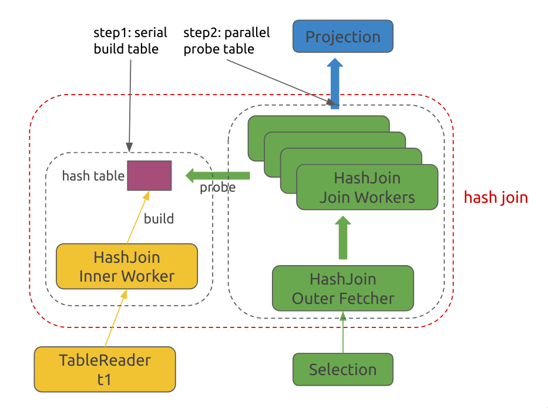
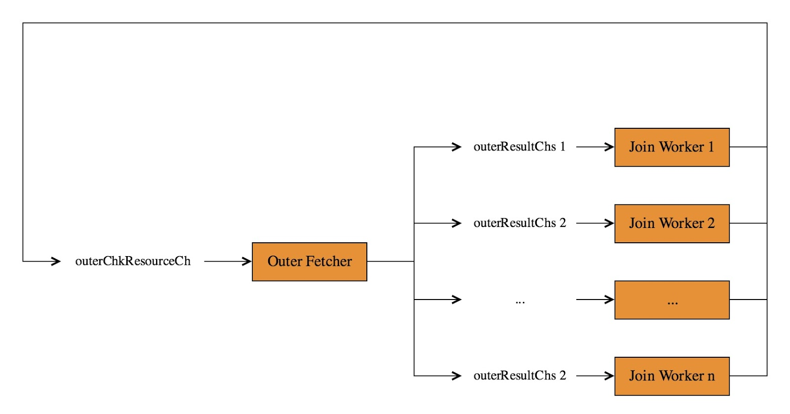
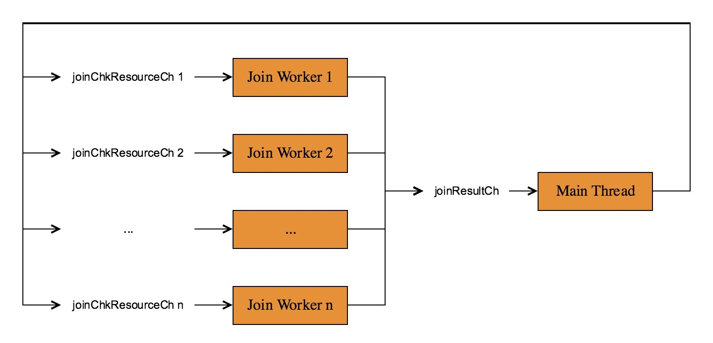

# Hash Join

## Overview

In this section we'll learn about Hash Join and its implement, and concurrent computation
. Hash Join is a common way to implement joins. In addition, TinySQL also implements [Merge Join](https://github.com/pingcap-incubator/tinysql/blob/df75611ce926442bd6074b0f32b1351ca4aad925/executor/merge_join.go#L24), which is more similar to Merge Sort, so you can read it by yourself if you are interested.

## Introduction to Hash Join Algorithms

Simply put, for a hash join of two tables, we select an inner table to construct a hash table, and then look for matching data in this hash table for each row of data in the outer table. So how can you improve the efficiency of Hash Join? After the hash table is built, the hash table is actually read-only, so the process of finding matches can actually be done in parallel, which means we can use multiple threads to check the hash table at the same time:

This can greatly improve the efficiency of Hash Join.

## Understanding the Code

As can also be seen from the image above, the main processes involved are as follows:

- Main Thread: There is one of the type of  thread, which performs the following tasks:
1. Read all of the Inner Table data and construct a hash table
2. Start Outer Fetcher and Join Worker to start background work and generate join results. The startup process for each goroutine is done by the fetchAndProbeHashTable function;
3. The Join result computed by the Join Worker is returned to the caller of the NextChunk interface.
- Outer Fetcher: There is one of the type of the thread, which is responsible for reading data from the Outer table and distributing it to various Join Workers;
- Join Worker: There are multiple of the type of the threads, responsible for checking the data of the hash table, the Inner and Outer tables matched by the Join, and passing the results to the Main Thread.

Next, let's take a detailed look at each stage of Hash Join.

### Main Thread read internal table data and constructs a hash table

The process of read the inner table data is done by the fetchAndBuildHashTable function. This process continuously calls Child's NextChunk interface, and stores the Chunk obtained from each function call into the HashRowContainer for use in the next computation.

The hash table we use here is essentially a linked list, connecting similar lists with the same key hash value in a way, so that subsequent searches for values with the same Key only need to iterate through the linked list.

### Outer Fetcher

Outer Fetcher is a back-office goroutine, and its main computational logic is in the function fetchouterSideHunks. It continuously read the data from the large table and distributes the obtained outer table data to each join worker. Here, the resource interaction between multiple threads can be represented by the following figure:

There are two channels involved in the image above:

1. OuterResultCHs [i]: One for each Join Worker. Outer Fetcher writes the obtained Outer Chunk to this channel for use by the corresponding Join Worker
2. OuterChkResourceCH: When the Join Worker runs out of the current Outer Chunk, it needs to write this Chunk along with its corresponding OuterResultChs [i] address to the OuterChkResourceCH channel, and tell Outer Fetcher two pieces of information:
1. I have provided you with a chunk, you can use this chunk directly to pull the outer data, no need to re-apply for memory;
2. I've used up my Outer Chunk, you need to send the pulled Outer data directly to me, don't give it to anyone else;

So, the overall computational logic of Outer Fetcher is:

1. Get an outerChkResource from outerChkResourcech and store it in the variable outerResource
2. Pull the data from Child and write the data into the chk field of OuterResource
3. Send this chk to OuterResultChs [i] of the Join Worker that requires data from the Outer Table. This information is recorded in the dest field of OuterResource

### Join Worker

Each Join Worker is a backend goroutine, and the main calculation logic is in the RunJoinWorker function.

There are two channels involved in the image above:

1. JoinchkResourceCH [i]: one for each Join Worker to store the results of the Join
2. JoinResultCH: The Join Worker writes the result Chunk and its JoinChkResourceCH address to this channel, telling Main Thread two things:
1. I've calculated the result of a Join in Chunk for you. After read this data, you can directly return it to the caller of the Next function
2. Give it back to me after you've used up this chunk, don't give it to anyone else, so I can keep working

So, the overall calculation logic of Join Worker is:

1. Get a Join Chunk Resource
2. Get an Outer Chunk
3. Check the hash table and write matching Outer Rows and Inner Rows into Join Chunk
4. Send the full Join Chunk to the Main Thread

### Main thread

The computational logic for the main thread is done by the nextChunk function. The computational logic for the main thread is pretty simple:

1. Get a Join Chunk from JoinResultCH
2. Exchanging data from chk and Join Chunk passed down by the caller
3. Return the Join Chunk to the corresponding Join Worker

## Assignments

implement [runJoinWorker](https://github.com/tidb-incubator/tinysql/blob/course/executor/join.go#L243) as well as [fetchAndBuildHashTable](https://github.com/tidb-incubator/tinysql/blob/course/executor/join.go#L148).

## Tests

- Pass all test cases with the exception of `TestJoin` through `join_test.go`.
- The `TestJoin` test case involves `aggregate` related method in project5-3. It can be tested after completing the entire project5, and the test will not count towards the score.

You can run tests via `make test-proj5-2`.

## Rating

Pass them all and get 100 points. Points will be deducted proportionately if any tests fail.
